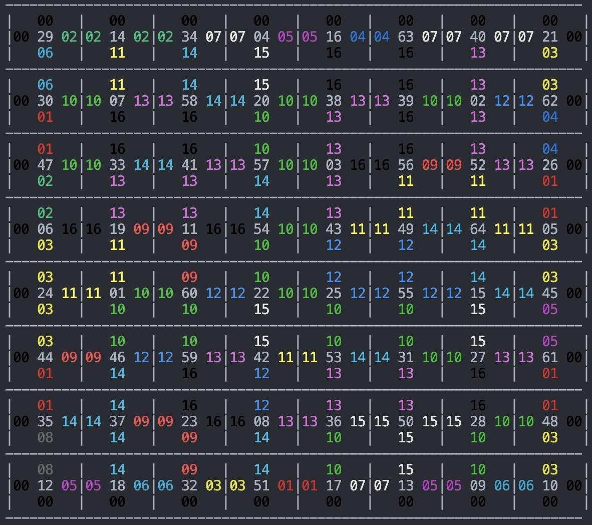

# Eternity2 Problem

The Eternity 2 puzzle is an edge matching problem. It involves placing square puzzle pieces constrained by the requirement to match adjacent edges. https://en.wikipedia.org/wiki/Eternity_II_puzzle


This version is a classic version of the eternity problem (meaning that heuristics used are fully deterministic). One can use predefined different heuristic for variable or value selection, or can even define its own variable or value selection heuristics.

Here, we developed three different kinds of modeling to compare the performances.
The first model uses a natural modeling.
The second one uses less constraints: it uses directly the edges as variables.
The third one is an extension of the second one, where we branch on the id of each piece as well as its orientation. It is slower, but it has the advantage of being more easily understandable, if the aim is to learn a good heuristique.

## Installation

To launch this example, you need to have the package `SeaPearl` added to your environment.

## Usage

Being inside that folder in the terminal (`examples/eternity2/`), you can launch:

```julia
julia> include("eternity2.jl")
julia> model_solved = solve_eternity2("data/eternity3x3")
julia> print_eternity2_v2(model_solved)
```

## Contributing

Pull requests are welcome. For major changes, please open an issue first to discuss what you would like to change.
Please make sure to update tests as appropriate.

#Example of plot

Using model 2, a solution for data/eternity8x8 was found in 2 hours. An example of the plotting :

